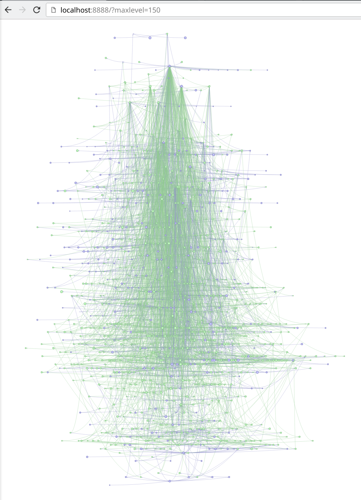

# pacvis

Visualize pacman local database using [Vis.js](http://visjs.org/),
inspired by [pacgraph](http://kmkeen.com/pacgraph/).

See a live demo at https://pacvis.farseerfc.me/ showing database of my arch server.




## How to use

Install dependencies:
```bash
pacman -S python-tornado pyalpm
```

Then

```bash
cd pacvis
./pacvis
```

Then go to http://localhost:8888/ .

You may need to zoom-in initially to see the rendered picture.
~~Currenly we have scalability issue when there are too may packages, so we need
`maxlevel` to limit the level of dependency depth.~~ We fixed the scalability
issue with a modified vis.js, but when there are more than 2000 packages the
layout algorithm is still slow (more than 5 mins).

## To be improved ...

- [ ] performance for layout algorithm can be improved
- [ ] we resolve dependency to package name using pyalpm directly now,
      and this information is lost on the graph
- [x] ~~we do not track optdepends now~~
      we draw optdepends on the graph but not consider them during topology_sort
- [x] ~~we need to estimate removable size (by `pacman -Rcs`)~~ done
- [x] more information from pacman can be intergrated
- [x] search by package name
- [ ] show only part of the packages (like `pactree`) instead of filtering by levels
- [x] ~~be visually attractive!~~ applied getmdl theme
- [ ] be compatible with older browsers (Safari, IE)
- [ ] make a `python setup.py install` or `PKGBUILD`
